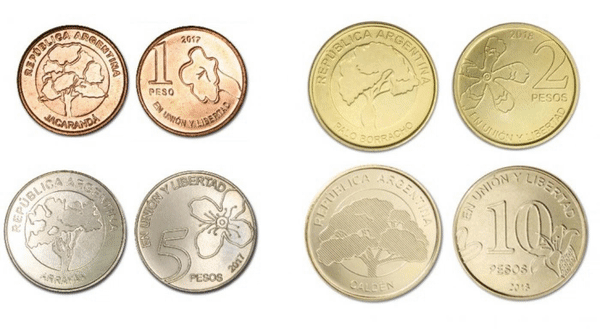

🧮 CONTANDO OBJETOS (Aplicando Umbralización/Thersholding) en Python - OpenCV

Para una descripción más detalla de este programa para la detección de monedas en una imagen usando umbralización simple o
thresholding puedes visitar:

Mi blog: https://omes-va.com/contando-objetos-aplicando-umbralizacion-thersholding/

Video: https://youtu.be/wBPIAGNTFzY

A continuación puedes ver el proceso que se ha realizado en monedasTH.py

