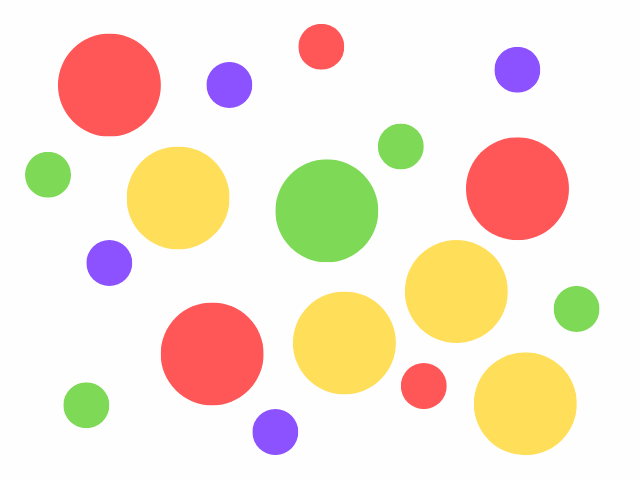

🧮 Contando por COLORES en Python-OpenCV

La aplicación que  realiza countColors.py es, dada la imagen lunares.png va a enumerar cada uno de los círculos dependiendo
de sus colores (amarillo, violeta, verde o rojo). Al final mostrará una imagen resumen de la cantidad de cpirculos encontrados
por colores y la suma de todos ellos. Para una explicación más detallada puedes visitar:

Mi blog: https://omes-va.com/contando-por-colores-en-python-opencv/

Video: https://youtu.be/DwPug0V8pcI

A continuación puedes ver el proceso que se ha realizado en countColors.py:

