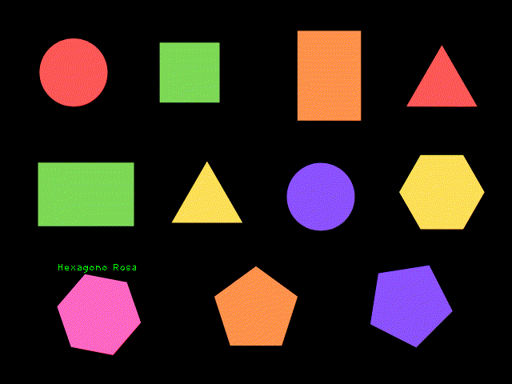

## Detecta FIGURAS GEOMÉTRICAS y sus COLORES ❤️🧡💛💚💜 OpenCV - Python

Para una descripción más detallada el proceso realizado puedes dirigirte a:

Mi blog: https://omes-va.com/detecta-figuras-geometricas-y-sus-colores-opencv-python/

Video: https://youtu.be/CsS0V6pDsBM

En figurasColores.py puedes encontrar la programación en Python para detectar figuras geométricas y sus colores. Puedes probar con las imágenes:
figurasColores.png y figurasColores2.png, y tendrás un resultado como el siguiente:

