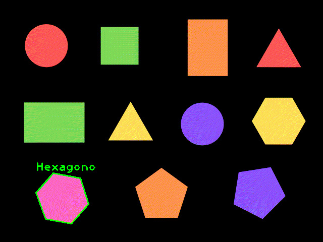

## Detectando FIGURAS GEOMÉTRICAS (🔵🔺⬛) con OpenCV - Python

Para una descripción más detallada el proceso realizado puedes dirigirte a:

Mi blog: https://omes-va.com/detectando-figuras-geometricas-con-opencv-python/

Video: https://youtu.be/R82EcsCgnfg

El script figurasGeometricas.py muestra como detectar figuras geométricas simples: triángulos, rectángulos, cuadrados, pentágonos, hexágonos
y círculos, lo puedes probar con las dos imágenes figurasColores.png y figurasColores2.png, y tendrás un resultado como el siguiente:

