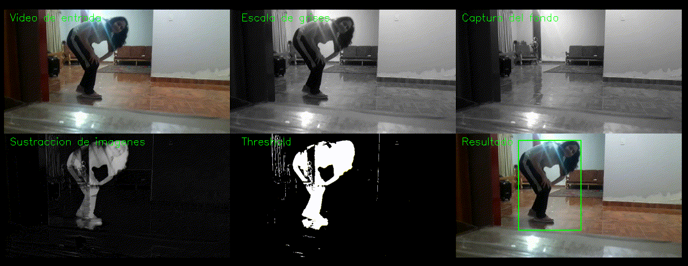

# 👣 DETECCIÓN DE MOVIMIENTO (Con sustracción de imágenes) - OpenCV y Python

Si deseas más información sobre la realización de este código, por favor dirígete al video que he realizado en youtube: https://youtu.be/kcmJQzu_q6M

O dirígente al post de mi web: https://omes-va.com/deteccion-de-movimiento-con-sustraccion-de-imagenes-opencv-y-python/

El proceso realizado dentro de detectMov.py, con el video Video.mp4 es el siguiente:

Finalmente se obtendrá la detección de movimiento con sustracción de imágenes:

